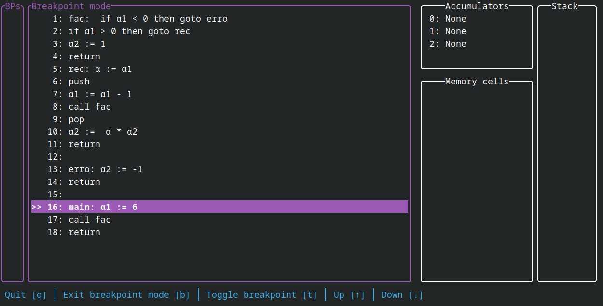

# alpha_tui

This is my attempt at writing a compiler for the Alpha-Notation used in my Systemnahe Informatik lecture at university.

Programs are read in and then compiled, a terminal ui is then opened where you can run the program line by line or by using breakpoints.

## Getting started

1. Download the [newest release]() specific for your system
2. Extract the .zip file 
3. Create a program by using the text editor of your choice or try an example program located in [examples/programs](examples/programs). The examples might help you write your program.
4. Run `alpha_tui` by opening a terminal in the folder and then typing `alpha_tui -i FILENAME`, for an example program this command could look like this: `alpha_tui -i examples/programs/faculty.alpha`
5. The terminal ui will open where you can run the program line by line by using the `[r]` key

### Compile from source

To compile the program from source the rust toolchain is needed. Once installed you can run the program by typing `cargo run`. To submit arguments you can use `--`, for example `cargo run -- -h` will print help.

## Instructions

See [instructions](instructions.md).

You can use either `#` or `//` to mark inline or full-line comments.

## Options

Accumulators and memory cells are automatically created when the input program is read.
To circumvent that you can set the option `-d`. You then need to specify the accumulators and memory_cells that should be created. The options `-a` and `-m` or `--memory-cell-file` can be used to specify those values.

If you require memory cells to be pre initialized you can use the option `--memory-cell-file` to read in a file that contains memory cell information. An example for such file can be found [here](examples/memory_cells.cells).

For a full list of options and more explanation see `alpha_tui --help`.

## Interface and usage

The interface is written using the [ratatui](https://github.com/ratatui-org/ratatui) library.

When a program is opened it can look like this: 

Press `[r]` to begin to run the program, subsequent instructions can also be run with `[r]`. Values that have changed and the line that was run last are highlighted.  This can look like this: 

When the last instruction was executed the following window is displayed. You can restart by pressing `[s]` or exit the program by pressing `[q]`. 

### Breakpoints

Breakpoints can be set to run all lines of code up until the line in which the breakpoint is set.

Press `[b]` to enter breakpoint mode, it could look like this:

Navigate by using the `arrow keys`, for ease of `[w]` and `[s]` are also supported. To `set` or `remove` a breakpoint in the selected line press the `[t]` key: 

Exit breakpoint mode by pressing the `[b]` key again. Press `[n]` when in run mode to make the program run automatically to the next breakpoint (note how the values to the right have been updated): 

### Error handling

[Miette](https://github.com/zkat/miette) is used for error handling, this provides helpful error messages when a program can not be compiled due to an unknown instruction.

Such error could look like this 

or this: 

## Future ideas

- [ ] Make instruction list scroll down to make 3 instructions before the current one always displayed
    - ratatui currently does not provide a simple solution for this
- [ ] Add command line parameter that allows a program to be run where the content of a specific accumulator or memory cell is compared against a defined value that is provided when the program is launched. Alpha_tui will exit with 0 if the resulting value is equal to the provided value. This will make it possible to automate tests for alpha notation programs.
- [ ] Move backend (internal runtime environment) into own project which makes it possible to write new programs without the need to copy the backend of this program
