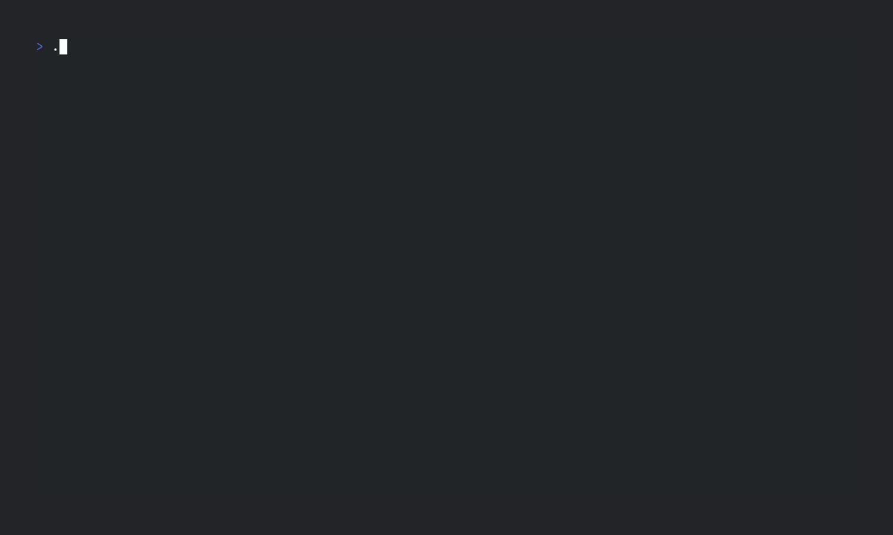

[](https://github.com/lmh01/alpha_tui/releases)

[](https://app.codecov.io/gh/LMH01/alpha_tui)

[](LICENSE)

# alpha_tui



This is my attempt at writing a runtime environment and debugger for the Alpha-Notation used in my Systemnahe Informatik lecture at university.

Programs are read in and interpreted, a terminal ui is then opened where you can run the program line by line or by using breakpoints. It is also supported to start a playground environment by using the `playground` command.

Pull requests and bug reports are welcome. See [CONTRIBUTING.md](CONTRIBUTING.md) for further details.

## Contents

1. [Getting started](#getting-started)
    - [Compile from source](#compile-from-source)
    - [NixOS (using flakes)](#nixos-using-flakes)
2. [Interface and usage](docs/interface_and_usage.md)
    - [Load command](docs/interface_and_usage.md#load-command)
    - [Playground command](docs/interface_and_usage.md#playground-command)
    - [Check command](docs/interface_and_usage.md#check-command)
    - [Error handling](docs/interface_and_usage.md#error-handling)
3. [Instructions](docs/instructions.md)
    - [Memory cells](docs/instructions.md#memory-cells)
    - [Substitutions](docs/instructions.md#substitutions)
    - [Examples](docs/instructions.md#examples)
4. [CLI options](docs/cli.md)
    - [General options](docs/cli.md#general-options)
    - [Examples](docs/cli.md#examples)

## Getting started

1. Download the [newest release](https://github.com/lmh01/alpha_tui/releases/latest) specific for your system
2. Extract the .zip file 
3. Create a program by using the text editor of your choice or try an example program located in [examples/programs](examples/programs). The examples might help you write your program.
4. Run `alpha_tui` by opening a terminal in the folder and then typing `.\alpha_tui load FILENAME`, for an example program this command could look like this: `.\alpha_tui load examples/programs/faculty.alpha`
5. The terminal ui will open where you can run the program line by line by using the `[r]` key

### Compile from source

To compile the program from source the rust toolchain is needed. Once installed you can run the program by typing `cargo run`. To submit arguments you can use `--`, for example `cargo run -- -h` will print help.

### NixOS (using flakes)

This Repository provides a flake. If you have flakes enabled you can use

```
nix run github:lmh01/alpha_tui <COMMAND> <PARAMS>
```

to build and run the program.