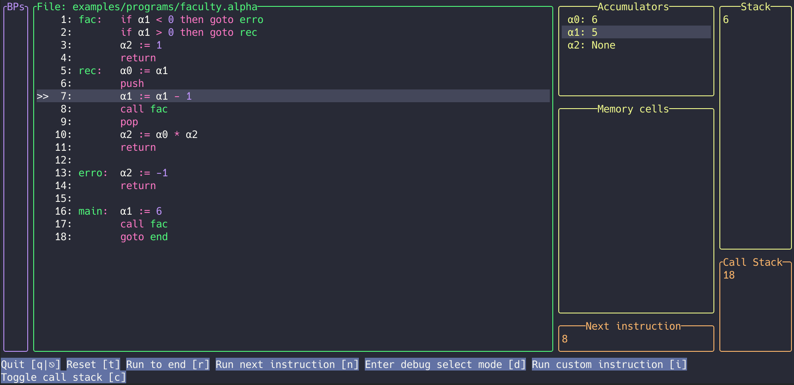
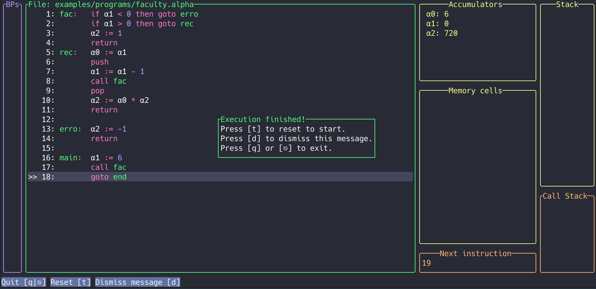
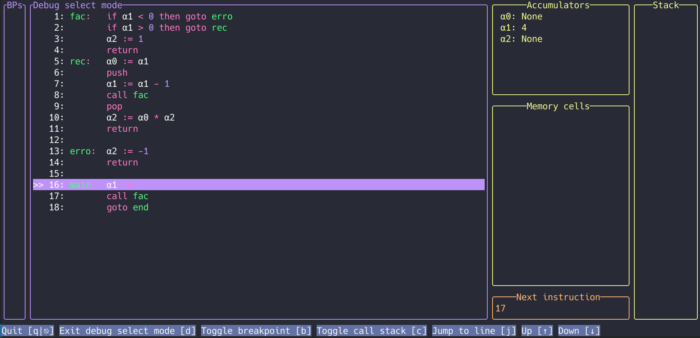
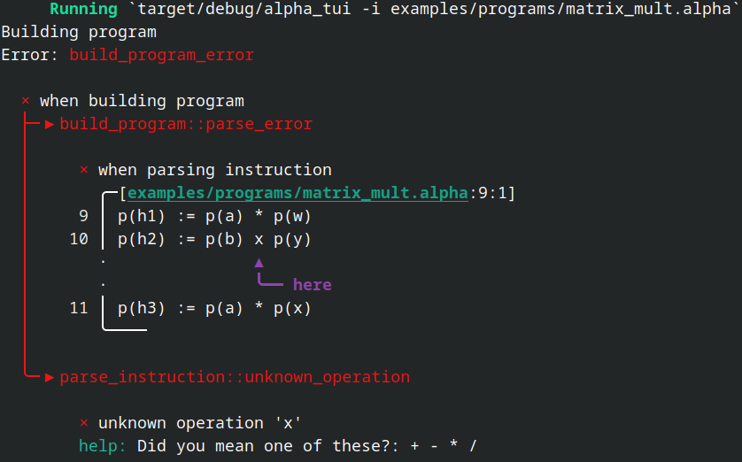
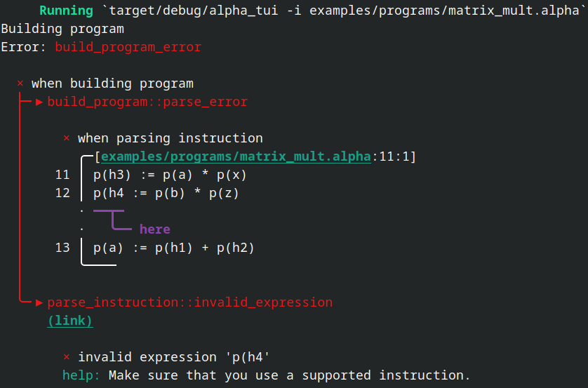

# alpha_tui

This is my attempt at writing a compiler for the Alpha-Notation used in my Systemnahe Informatik lecture at university.

Programs are read in and then compiled, a terminal ui is then opened where you can run the program line by line or by using breakpoints.

Pull requests and bug reports are welcome. See [CONTRIBUTING.md](CONTRIBUTING.md) for further details.

## Getting started

1. Download the [newest release](https://github.com/lmh01/alpha_tui/releases/latest) specific for your system
2. Extract the .zip file 
3. Create a program by using the text editor of your choice or try an example program located in [examples/programs](examples/programs). The examples might help you write your program.
4. Run `alpha_tui` by opening a terminal in the folder and then typing `alpha_tui -i FILENAME`, for an example program this command could look like this: `alpha_tui -i examples/programs/faculty.alpha`
5. The terminal ui will open where you can run the program line by line by using the `[r]` key

### Compile from source

To compile the program from source the rust toolchain is needed. Once installed you can run the program by typing `cargo run`. To submit arguments you can use `--`, for example `cargo run -- -h` will print help.

## Instructions

See [instructions](instructions.md).

You can use either `#` or `//` to mark inline or full-line comments.

## Options

Accumulators and memory cells are automatically created when the input program is read.
To circumvent that you can set the option `--disable-memory-detection`. You then need to specify the accumulators and memory_cells that should be created. The options `-a`, `-m` and `--memory-cell-file` can be used to specify those values. `--memory-cell-file` can also be used to specify available memory cells, when automatic detection is disabled.

If you require memory cells to be pre initialized you can use the option `--memory-cell-file` to read in a file that contains memory cell information. An example for such file can be found [here](examples/memory_cells.cells).

By default the code that is read will be formatted to be easier to read, this can be disabled by using the `--disable-alignment` flag. If you however would like to write the formatted code into the source file you can use the `--write-alignment` flag.

For a full list of options and more explanation see `alpha_tui --help`.

## Interface and usage

The interface is written using the [ratatui](https://github.com/ratatui-org/ratatui) library.

When a program is opened it can look like this: 

Press `[r]` to begin to run the program, subsequent instructions can also be run with `[r]`. Values that have changed and the line that was run last are highlighted.  This can look like this: 

When the last instruction was executed the following window is displayed. You can restart by pressing `[s]` or exit the program by pressing `[q]`. 

### Debug features

Some debug features require you to select a line in which a debug action should take place.

You can enter debug select mode by pressing `[d]`, this could look like this: 

Navigate by using the `arrow keys`, for ease of use `[w]` and `[s]` are also supported.

#### Breakpoints

Breakpoints can be set to run all lines of code up until the line in which the breakpoint is set.

To set a breakpoint enter `debug select mode` and press `[t]` in the line in which you want to set the breakpoint. A star to the left will indicate where a breakpoint is placed.

A placed breakpoint can look like this: 

Press `[n]` when in run mode to make the program run automatically to the next breakpoint (note how the values to the right have been updated): 

#### Jump to line

When in `debug select mode` you can select a line and jump directly to it using `[j]`, skipping all other instructions. You should however be careful when using this, because runtime errors are far more likely to occur due to uninitialized accumulators or memory cells.
Functions may also no longer be properly exited because of a misaligned call stack.

### Error handling

[Miette](https://github.com/zkat/miette) is used for error handling, this provides helpful error messages when a program can not be compiled due to an unknown instruction.

Such error could look like this 

or this: 

## Future ideas

- [ ] Make instruction list scroll down to make 3 instructions before the current one always displayed
    - ratatui currently does not provide a simple solution for this
- [ ] Add command line parameter that allows a program to be run where the content of a specific accumulator or memory cell is compared against a defined value that is provided when the program is launched. Alpha_tui will exit with 0 if the resulting value is equal to the provided value. This will make it possible to automate tests for alpha notation programs.
- [ ] Move backend (internal runtime environment) into own project which makes it possible to write new programs without the need to copy the backend of this program
- [ ] Text editor inside the program to write new alpha notation programs
    - This would however come with a drawback, the nice error messages could probably not be shown inside the tui.
