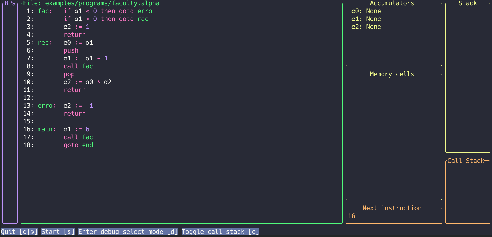
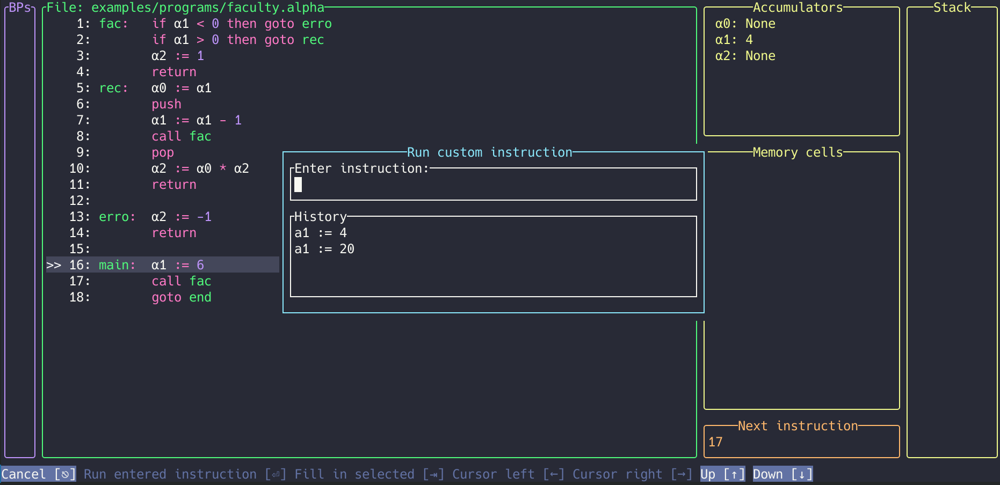
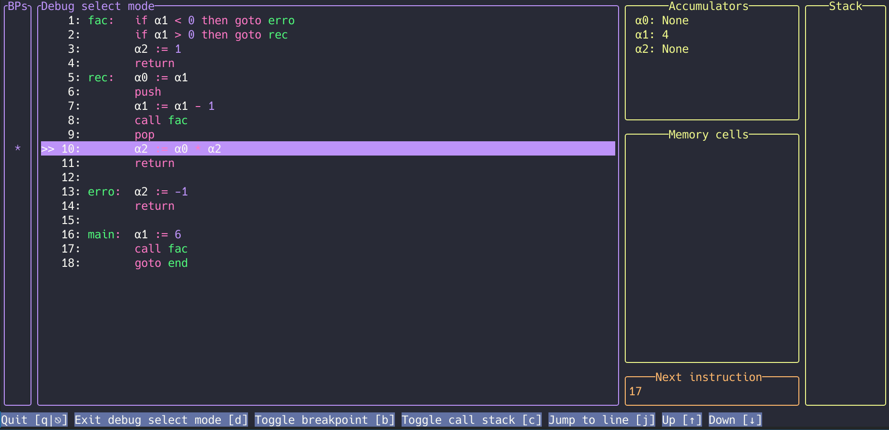
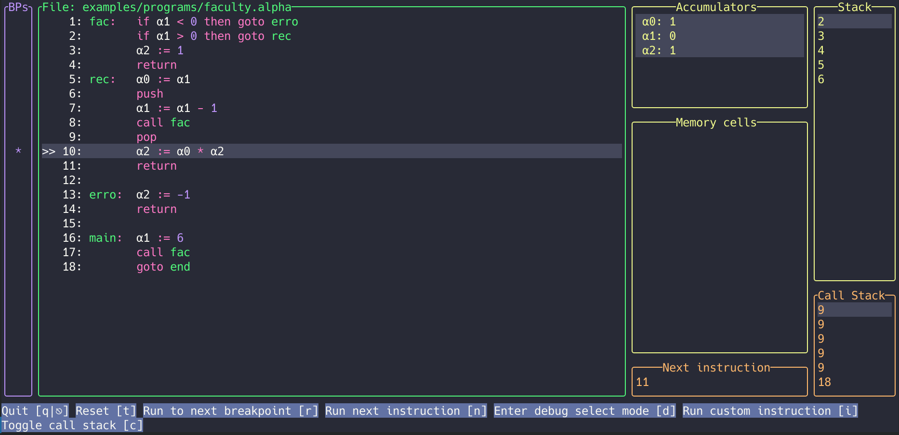
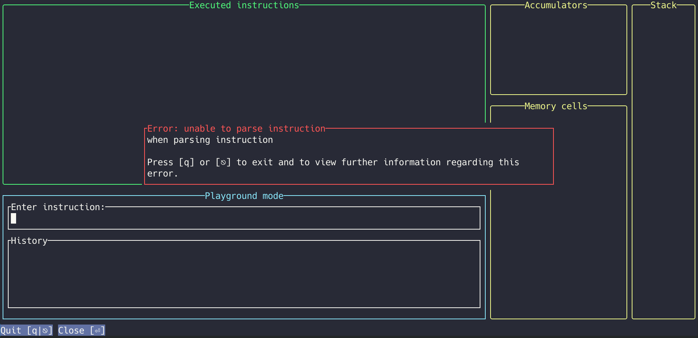

# Interface and usage

## Commands

The program understands the following commands:

- [load](#load-command)
- [playground](#playground-command)
- [check](#check-command)

## Load command

The main command to compile and run a program is the `load` command, it takes the file as first parameter. Example: `alpha_tui load examples/programs/faculty.alpha`.

By default the code that is read will be formatted and syntax highlighted to be easier to read, this can be disabled by using the `--disable-alignment` and `--disable-syntax-highlighting` flags. If the formatting should be written to the source file you can use the `--write-alignment` flag. If you wrote `a`, `p` and `y` in your source file, the greek alphabet equivalent ($\alpha,\rho,\gamma$) will be displayed.

Predetermined breakpoints can be loaded by using the `--breakpoints` flag, it takes multiple line numbers as parameter. Example: `alpha_tui load examples/programs/faculty.alpha -b 5`.

By using the `--custom-instruction-history-file` a file can be provided to the program that contains instructions that should be used to fill the instruction history inside the popup window, where a custom instruction can be entered. When this is supplied, the file is first checked if all instructions that are stored within it are valid. Custom instructions that are run which are not yet contained in this file will be added to it.

To see all arguments that are available with this command use `.\alpha_tui help load`.

When a program is loaded it can look like this: 

Press `[s]` to begin to run the program, subsequent instructions can be run with `[n]`. Values that have changed and the line that was run last are highlighted.  This can look like this: 

When the last instruction was executed the following window is displayed. You can restart by pressing `[t]` or exit the program by pressing `[q]`. 

Below the memory cells section the address of the instruction that is executed next is displayed.

When a program is loaded that contains at least one `CALL` function, the internal `Call stack` is automatically displayed at the right side of the tui. This call stack contains the addresses of instructions where the execution should continue when `return` is called. This window can be manually shown or hidden by using `[c]`.

### Custom instructions

When in the normal run mode, you can press the `i` key to open up a popup window where a custom instruction can be entered, that should be executed at the current position in the program. You can use the `up` and `down` arrow keys to navigate the history of executed custom instructions. If an instruction is selected in that list, it is executed by pressing `enter`. By typing in the input field you can filter the list. To deselect the list and use the instruction newly written into the text field, press the `up` arrow key, until the list is no longer selected. Pressing `enter` will run the instruction written in the text field.

The popup window can look like this: 

Or this if the command history contains elements: 

If the instruction could not be parsed a simple error is displayed, quit the program with `q` to receive further information on why the instruction could not be parsed.

If a value is assigned to an accumulator or memory cell that does not yet exist, it is created automatically. This does only apply however, if `--disable-memory-detection` is set.

#### Pitfalls

Using this feature may lead to some unexpected behavior, as the normal program flow is changed. The result might be that the program is broken and runtime errors occur.

Another thing that might occur is, that if a `goto` or `call` instruction is used, the highlighted line might not be the line that was actually executed. This is a visual issue only, it does not effect what instruction is run. After 2-3 steps the highlighted instruction should match the executed instruction again.

### Debug features

Some debug features require you to select a line in which a debug action should take place.

You can enter debug select mode by pressing `[d]`, this could look like this: 

Navigate by using the `arrow keys`, for ease of use `[w]` and `[s]` are also supported.

#### Breakpoints

Breakpoints can be set to run all lines of code up until the line in which the breakpoint is set.

To set a breakpoint enter `debug select mode` and press `[b]` in the line in which you want to set the breakpoint. A star to the left will indicate where a breakpoint is placed.

A placed breakpoint can look like this: 

Press `[r]` when in run mode to make the program run automatically to the next breakpoint (note how the values to the right have been updated): 

#### Jump to line

When in `debug select mode` you can select a line and jump directly to it using `[j]`, skipping all other instructions. You should however be careful when using this, because runtime errors are far more likely to occur due to uninitialized accumulators or memory cells.
Functions may also no longer be properly exited because of a misaligned call stack.

## Playground command

The `playground` subcommand can be used to start a playground session where instructions can be run. Note however that the instructions `CALL`, `GOTO`, `IF` and `RETURN` are not supported in this environment, because these instructions require labels to be present, using them anyway will lead to an error.

To start the program in playground mode, use the command `.\alpha_tui playground`. The following window will open:

Some accumulators and memory cells are automatically created, this can be overwritten by using the arguments `--accumulators` and `--memory-cells` or `--memory-config-file`, see [memory config file](cli.md#memory-config-file) for more.

Type any valid instruction (see [instructions](instructions.md)) and press enter to execute it. The accumulator and memory cell values affected will be updated and highlighted.

If accumulators or memory cells are accessed (read/write) that don't exist, a runtime error occurs, so make sure to only use accumulators and memory cells that are available.

The central area labeled "Executed instructions" contains the instructions that have been executed, where the instruction, that was executed the latest, is displayed at the bottom.

The area labeled "History" also contains a history of entered commands but this history can be loaded from a file (see [instruction history](cli.md#instruction-history)), is searchable and scrollable. If an element is selected in that list, the `ENTER` key can be pressed to execute it or the `TAB` key can be used to copy its text into the editable text area to modify it.

If an instruction was entered, that could not be parsed, an error popup is displayed, this can look something like this:

Unfortunately it is not possible to print the nice and informative error message into that window, to view it the `q` key needs to be pressed to exit the program. The error message is then displayed in the console. To simply close it, use the `ENTER` key.

## Check command

The `check` subcommand can be used to perform checks on the program. It is currently supported to check if the program compiles or if the program compiles and runs without an error. For example the command `alpha_tui check examples/programs/faculty.alpha compile` will check if the program compiles and return `0` if it did. Otherwise an error code is returned, see below for the meaning.

### Return values

These are the different return values of the check command:

| value | meaning |
| -: | - |
| 0 | check was successful |
| 1 | compilation error |
| 2 | runtime error |
| 10 | io error |

### Error handling

[Miette](https://github.com/zkat/miette) is used for error handling, this provides helpful error messages when a program can not be compiled due to an unknown instruction.

Such error could look like this 

or this: 

If a program can not be build, because certain instructions are not allowed, the following error could be displayeD:

